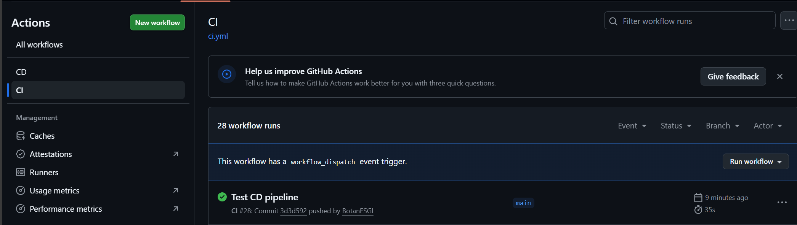
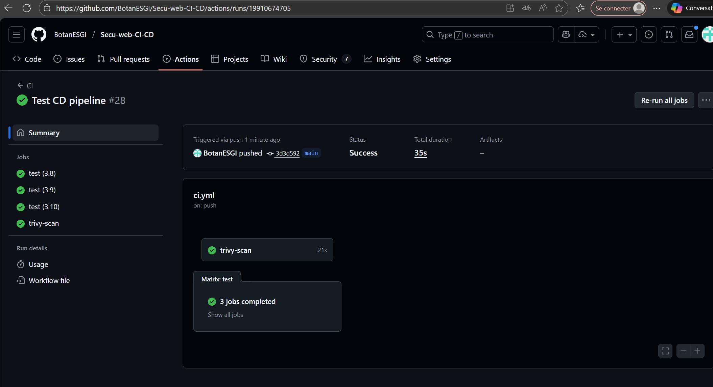
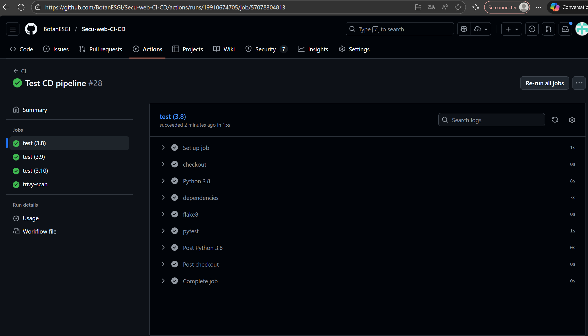
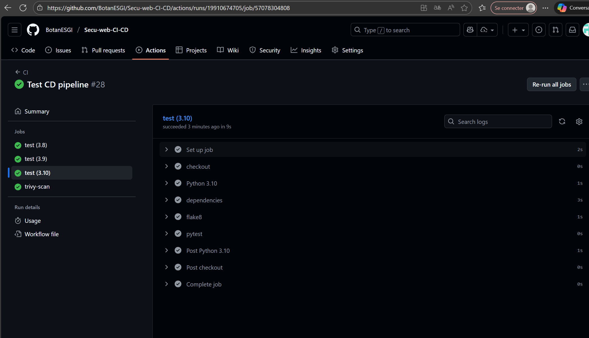
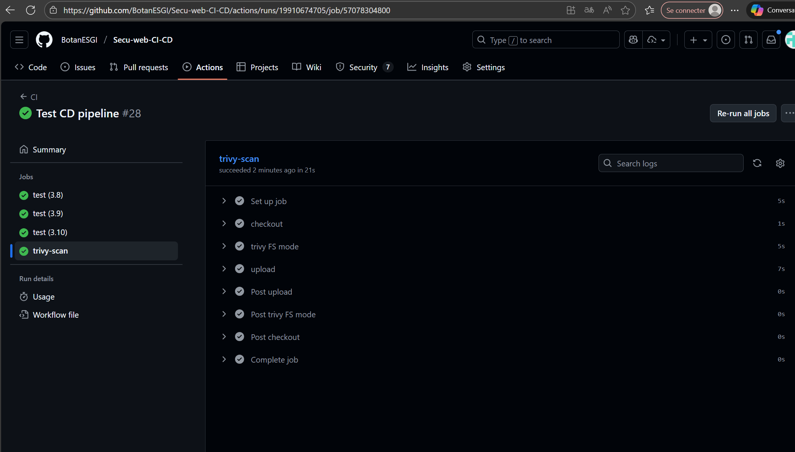
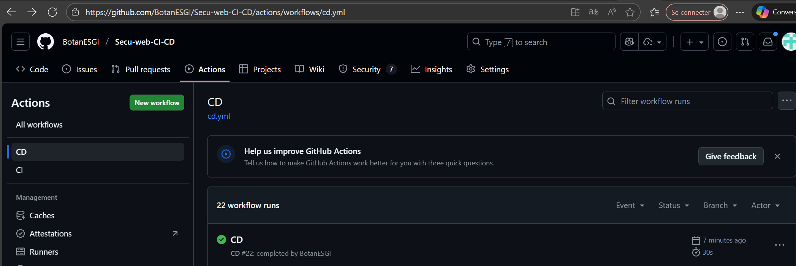
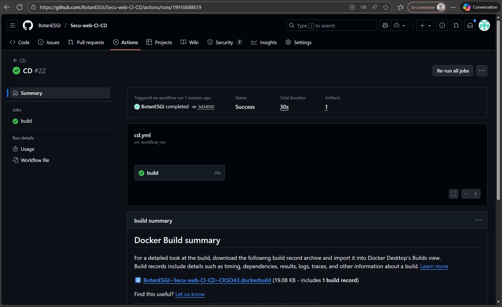
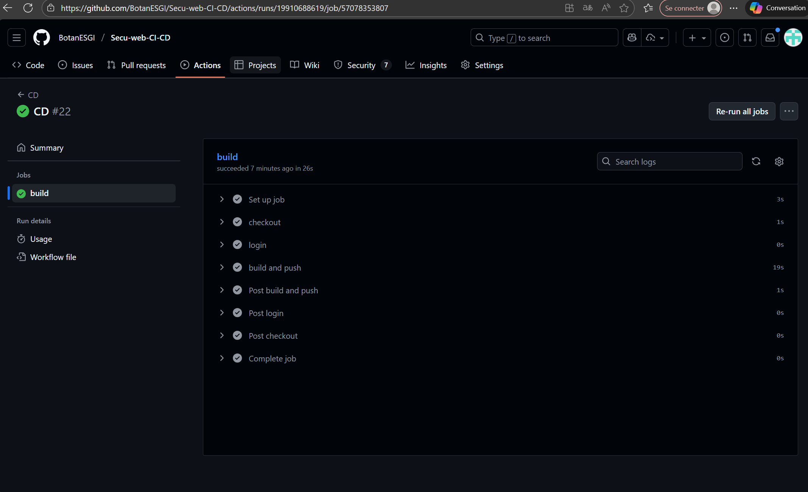
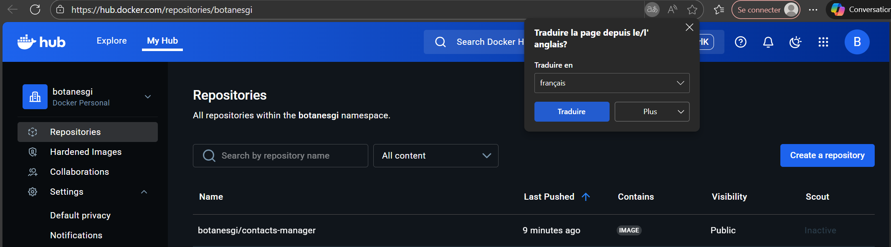
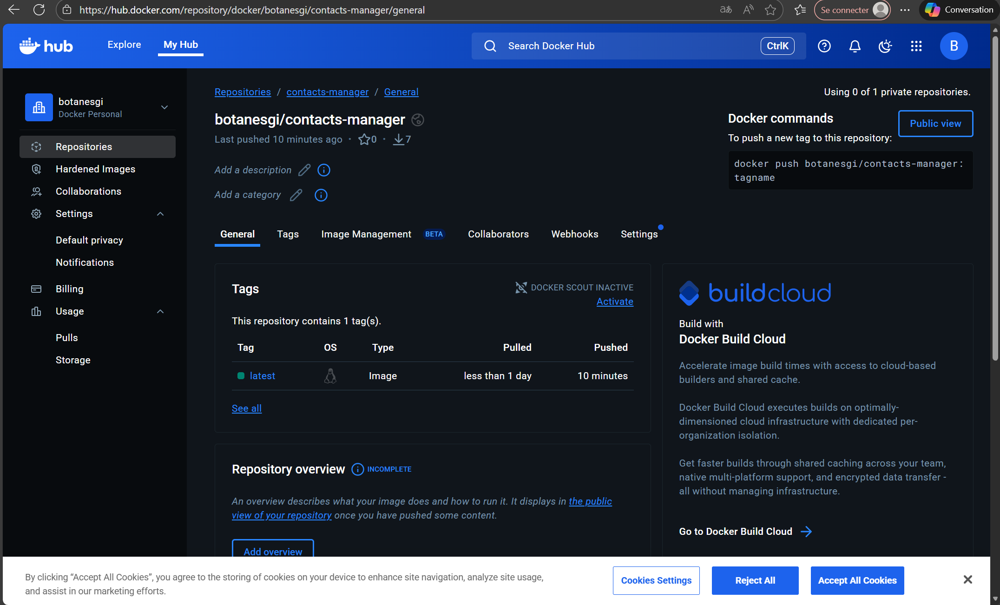

# Documentation - Pipeline CI/CD

## Membres du groupe
- Botan
- Aya
- Meryem

## 1. URL du repository GitHub public

**Repository GitHub :** https://github.com/BotanESGI/Secu-web-CI-CD

## 2. Screenshot du pipeline CI qui passe (tous les jobs)







## 3. Screenshot du pipeline CD qui passe




## 4. Screenshot du repository Docker Hub montrant l'image poussée




## 5. Fichiers créés

### 5.1. Fichier `.github/workflows/ci.yml`

```yaml
name: CI

on:
  push:
    branches:
      - main
      - master
  workflow_dispatch:

permissions:
  contents: read
  security-events: write
  actions: read

jobs:
  test:
    runs-on: ubuntu-latest
    strategy:
      matrix:
        python-version: ['3.8', '3.9', '3.10']
    steps:
      - name: checkout
        uses: actions/checkout@v5

      - name: Python ${{ matrix.python-version }}
        uses: actions/setup-python@v6
        with:
          python-version: ${{ matrix.python-version }}

      - name: dependencies
        run: |
          python -m pip install --upgrade pip
          pip install -r requirements.txt
          pip install flake8 pytest

      - name: flake8
        run: |
          # Premier run : E9, F63, F7, F82 avec affichage des sources et statistiques
          flake8 . --count --select=E9,F63,F7,F82 --show-source --statistics
          # Deuxième run : compter toutes les erreurs, retourner 0 même avec erreurs, afficher les statistiques
          flake8 . --count --exit-zero --max-complexity=10 --max-line-length=127 --statistics

      - name: pytest
        run: |
          pytest tests/

  trivy-scan:
    runs-on: ubuntu-latest
    steps:
      - name: checkout
        uses: actions/checkout@v5

      - name: trivy FS mode
        uses: aquasecurity/trivy-action@0.33.1
        with:
          scan-type: 'fs'
          format: 'sarif'
          output: 'results.sarif'
          severity: 'CRITICAL,HIGH'

      - name: upload
        uses: github/codeql-action/upload-sarif@v4
        with:
          sarif_file: 'results.sarif'
```

### 5.2. Fichier `.github/workflows/cd.yml`

```yaml
name: CD

on:
  workflow_run:
    workflows: ["CI"]
    types:
      - completed
    branches:
      - main
      - master

jobs:
  build:
    if: github.event.workflow_run.conclusion == 'success'
    runs-on: ubuntu-latest
    steps:
      - name: checkout
        uses: actions/checkout@v5

      - name: login
        uses: docker/login-action@v3
        with:
          username: ${{ secrets.DOCKER_USERNAME }}
          password: ${{ secrets.DOCKER_PASSWORD }}

      - name: build and push
        id: push
        uses: docker/build-push-action@v6
        with:
          context: .
          file: ./Dockerfile
          push: true
          tags: ${{ secrets.DOCKER_USERNAME }}/contacts-manager:latest
```

## Tests end-to-end

Le pipeline complet a été testé :
- ✅ Push sur GitHub → CI se déclenche automatiquement
- ✅ CI passe → CD se déclenche automatiquement
- ✅ CD passe → Image Docker poussée sur Docker Hub
